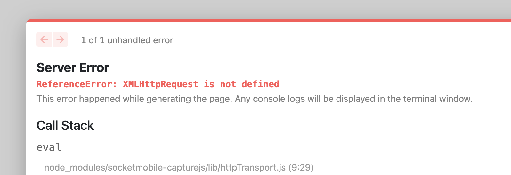

# socketmobile-capturejs 1.3.50

This Javascript NPM package can be used to add CaptureJS to your Javascript application.

NOTE: If your application is a react-native application please use react-native-capture package which has some native code to make CaptureJS working in iOS and Android.

## Usage

Add the CaptureJS in your Node project:

```sh
npm i socketmobile-capturejs --save
```

Using CaptureJS in the code:

```sh
import { Capture } from 'socketmobile-capturejs';
import React from 'react';
```

# Devices compatibility and CaptureSDK versions

|                    Devices                     | < 1.3 | 1.3 |
| :--------------------------------------------: | :---: | :-: |
|               **SocketCam C820**               |  ❌   | ❌  |
|               **S720/D720/S820**               |  ❌   | ✅  |
| **D600, S550, and all other barcode scanners** |  ✅   | ✅  |

## Use with Next.js

For use with Next.js, you will likely receive the below error.



This is because `XmlHttpRequest` is not available server-side. We are working on more concise solution but for now you can use the below workaround to use captureJs in a Next.js project.

First, you need to install `next-transpile-modules` and you need to add the below code in your `next.config.js`.

```
const withTM = require("next-transpile-modules")(["socketmobile-capturejs"]);
module.exports = withTM({
  webpack5: false,
  //your other exports
});
```

After that, you will need to install the xhr2 package which will enable you to use XMLHttpRequest server side. Then you will need to add this code into your root file (ex: \_app.js).

```
// hack for "next build"
import xhr2 from "xhr2";
import '../styles/globals.css'

// if SSR is working now, replace XMLHttpRequest with lib
if (typeof globalThis.window?.document?.createElement === 'undefined') {
  globalThis.XMLHttpRequest = xhr2;
}
```

Then in your pages or index.js file you can import socketmobile-capture modules. Note: You cannot import socketmobile-capture modules in the same file that you write the above global check or you will get the same undefined XMLHttpRequest error. For more on this type of error, check out the issue raised [here](https://github.com/SocketMobile/socketmobile-capturejs/issues/1).

## Help

The online documentation is available here: https://docs.socketmobile.com/capturejs/en/latest/
